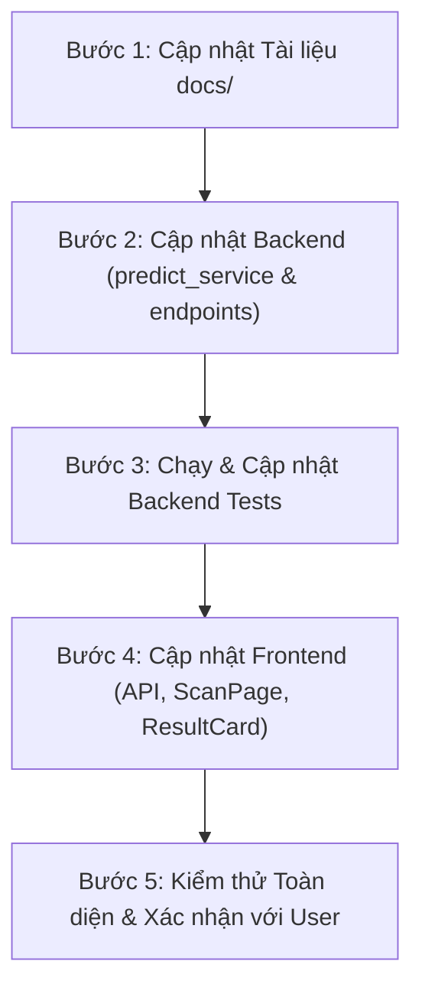

# Kế hoạch Triển khai: Phân luồng Inference 2 Tầng & Lựa chọn Model cho Từng Role

> **Tài liệu tham chiếu:** `docs/architecture/overview.md`, `docs/architecture/api/endpoints.md`, `docs/architecture/api/ood-contract.md`, `docs/project/roles.md`.  
> **Nhánh thực hiện:** `dt-test`  
> **Người lập:** AI Assistant  
> **Ngày:** 2026-10-08  

---

## 1. Tóm tắt Yêu cầu & Mục tiêu

Người dùng yêu cầu tái cấu trúc luồng chẩn đoán (inference) và giao diện lựa chọn mô hình:
1. **Đối với Guest (Chưa đăng nhập):**
   - Chỉ chạy và **dừng lại ở Tầng 1** (sử dụng 1 mô hình cơ bản `efficientnet_b0`).
   - Nếu độ tin cậy không đạt tỉ lệ % quy định (ngưỡng MSP đã calibrate, ví dụ ~93.3% theo OOD contract): Hệ thống thông báo và hiển thị rõ **"Không phải lá"** (`is_valid_leaf = false`, `label = null`).
2. **Đối với các Role đã đăng nhập (`user`, `technician`, `manager`, `admin`):**
   - Được phép **chọn model** để sử dụng (theo danh sách model mà role đó có quyền).
   - Khi chạy suy luận: **Bắt buộc phải qua 2 tầng** rồi mới trả ra kết quả (Tầng 1: model do user chọn làm Primary; Tầng 2: các model còn lại trong tier để kiểm tra chéo / ensemble). Không ngắt sớm và không cho phép chạy đơn lẻ (single-only).
3. **Đối với Frontend (Web App):**
   - Chỉ hiển thị bộ chọn **Model** (danh sách mô hình được phép).
   - **Tuyệt đối không hiển thị tuỳ chọn Single hay Ensemble** cho người dùng chọn (ẩn/loại bỏ UI chọn strategy; mặc định dưới hệ thống luôn chạy quy trình 2 tầng).
4. **Kiểm tra và đồng bộ tài liệu (`docs/`):**
   - Rà soát các tài liệu hiện hữu, chỉ ra những điểm chưa khớp và cập nhật lại toàn bộ tài liệu kiến trúc, API và phân quyền.

---

## 2. Rà soát & Đánh giá Hiện trạng Tài liệu (`docs/`)

Sau khi kiểm tra 4 tài liệu cốt lõi trong thư mục `docs/`:

| Tài liệu | Hiện trạng ghi nhận | Điểm chưa khớp với yêu cầu mới | Hướng cập nhật |
|---|---|---|---|
| [`docs/architecture/overview.md`](file:///c:/Project/plant-disease/docs/architecture/overview.md) | Ghi luồng chung `POST /predict (file, mode, strategy, model_type, farm_id?)` và checks `conf ≥ 0.3, margin ≥ 0.05, JS ≤ tier`. | - Chưa nêu rõ phân nhánh riêng biệt: Guest chỉ chạy Tầng 1; User đăng nhập bắt buộc qua 2 tầng.<br>- Chưa phản ánh việc FE chỉ cho chọn model, không cho chọn strategy. | Cập nhật sơ đồ luồng dữ liệu end-to-end phân tách rõ 2 luồng: Guest (Tầng 1 + threshold MSP) và Authenticated (Chọn Model + Chạy 2 Tầng). |
| [`docs/architecture/api/endpoints.md`](file:///c:/Project/plant-disease/docs/architecture/api/endpoints.md) | Endpoint `POST /predict` cho phép cả `strategy (ensemble/single)`. | - FE sẽ không còn gửi `strategy=single`.<br>- Cần tài liệu hóa rõ `primary_model` là model do user chọn. | Ghi rõ quy ước: User chọn model chính thông qua `primary_model`, mặc định thực thi pipeline 2 tầng. |
| [`docs/architecture/api/ood-contract.md`](file:///c:/Project/plant-disease/docs/architecture/api/ood-contract.md) | Tier `basic` có ngưỡng MSP `0.933487`. Nhưng mục quyết định ở BE lại ghi chung `confidence ≥ 0.3`. | - Code BE trước đó (`predict_service.py` L512) dùng nhầm `CONFIDENCE_THRESHOLD = 0.3` cho model đơn thay vì dùng ngưỡng calibrated MSP `0.933487` của tier basic.<br>- Chưa làm rõ quy trình 2 tầng bắt buộc cho role đăng nhập. | Định nghĩa rõ 2 bộ quy tắc quyết định:<br>1. **Tầng 1 (Guest)**: `msp >= msp_threshold (0.933487)` & `margin >= 0.05`. Dưới ngưỡng => OOD ("Không phải lá").<br>2. **2 Tầng (Authenticated)**: Tầng 1 chạy model chọn -> Tầng 2 ensemble soft-vote + JS divergence check. |
| [`docs/project/roles.md`](file:///c:/Project/plant-disease/docs/project/roles.md) | Khách dùng `basic`. User/Manager dùng `standard`. Tech/Admin dùng `advanced`. Ghi "Cảnh báo ảnh không hợp lệ chỉ cho role đăng nhập". | - Chưa ghi rõ quyền chọn model của từng role.<br>- Ghi sai việc Guest không nhận cảnh báo không hợp lệ (thực tế Guest quét không phải lá thì phải thấy ngay). | Bổ sung ma trận chọn model theo role và quy định cảnh báo "Không phải lá" cho Guest tại Tầng 1. |

---

## 3. Kiến trúc Luồng Xử lý Đề xuất (Two-Tier Inference Architecture)

### 3.1. Phân quyền Lựa chọn Model (Model Scope Matrix)

Dựa trên tier tối đa của từng role:

| Đối tượng | Role | Quyền chọn Model | Model khả dụng | Cơ chế thực thi |
|---|---|---|---|---|
| **Khách** | `guest` (chưa login) | **Không** (cố định) | `efficientnet_b0` | **Chỉ Tầng 1**: Kiểm tra ngưỡng MSP calibrated (0.933487). Không đạt => Hiện "Không phải lá". |
| **Nông dân** | `user` | **Có** | `efficientnet_b0`, `mobilenet_v2` | **Bắt buộc 2 Tầng**: Model được chọn là Primary (Tầng 1) + Model còn lại (Tầng 2) -> Soft-voting & JS check. |
| **Quản lý** | `manager` | **Có** | `efficientnet_b0`, `mobilenet_v2` | **Bắt buộc 2 Tầng**: Model được chọn là Primary (Tầng 1) + Model còn lại (Tầng 2) -> Soft-voting & JS check. |
| **Kỹ thuật viên** | `technician` | **Có** | `efficientnet_b0`, `mobilenet_v2`, `resnet50` | **Bắt buộc 2 Tầng**: Model được chọn là Primary (Tầng 1) + 2 Model còn lại (Tầng 2) -> Soft-voting & JS check. |
| **Quản trị viên** | `admin` | **Có** | `efficientnet_b0`, `mobilenet_v2`, `resnet50` | **Bắt buộc 2 Tầng**: Model được chọn là Primary (Tầng 1) + 2 Model còn lại (Tầng 2) -> Soft-voting & JS check. |

### 3.2. Chi tiết Luồng 1: Dành cho Guest (Dừng ở Tầng 1)

```
Guest Upload Ảnh
       │
       ▼
Backend: Chế độ Basic (Tầng 1 duy nhất: EfficientNet-B0)
       │
       ├─ Tính Calibrated MSP = max(softmax(logits / T))
       ├─ Lấy ngưỡng calibrated msp_threshold = 0.933487 (từ ood_threshold.json)
       │
       ├─ KIỂM TRA NGƯỠNG:
       │    Nếu msp >= 0.933487 VÀ margin >= 0.05:
       │        => is_valid_leaf = True, validation_status = "accepted", trả kết quả bệnh
       │    Nếu msp < 0.933487 HOẶC margin < 0.05:
       │        => is_valid_leaf = False, validation_status = "low_confidence", label = null
       ▼
Frontend:
       - Nếu is_valid_leaf = False: Hiển thị thẻ màu cam "Không phải lá" / "Ảnh không phải lá hợp lệ".
```

### 3.3. Chi tiết Luồng 2: Dành cho Role Đã Đăng Nhập (Bắt buộc Qua 2 Tầng)

```
User chọn Model (ví dụ: MobileNet-V2) + Upload Ảnh
       │
       ▼
Backend: Xác định Tier theo Role (Standard hoặc Advanced)
       │  Sắp xếp danh sách model:
       │  - Tầng 1 (Primary): Model người dùng chọn (MobileNet-V2)
       │  - Tầng 2 (Auxiliary): Các model còn lại của Tier (EfficientNet-B0)
       │
       ├─ [TẦNG 1] Chạy Primary Model
       │    - Ghi nhận dự đoán và độ tin cậy ban đầu của Primary Model.
       │    - KHÔNG ngắt sớm (bỏ stage_1_early_exit để đảm bảo luôn qua Tầng 2).
       │
       ├─ [TẦNG 2] Chạy các Model Phụ Trợ (Parallel hoặc Sequential)
       │    - Thu thập calibrated probabilities của tất cả các model.
       │
       ├─ [TỔNG HỢP 2 TẦNG] Soft-Voting Ensemble & Kiểm định OOD
       │    - Mean probabilities = trung bình cộng các model.
       │    - Tính JS Divergence (chuẩn hoá) giữa các model.
       │    - Kiểm tra các quy tắc:
       │        + confidence (ensemble) >= 0.3
       │        + top1_top2_margin >= 0.05
       │        + js_divergence <= ngưỡng tier (0.031 cho standard, 0.032 cho advanced)
       │    - Đánh giá Agreement Status (agreed / disagreed / degraded).
       │
       ▼
Frontend:
       - Hiển thị kết quả chẩn đoán bệnh từ mô hình kết hợp 2 tầng.
       - Hiển thị thông tin mô hình chính đã chọn cùng trạng thái kiểm định 2 tầng.
```

---

## 4. Chi tiết Các Thay Đổi Cần Thực Hiện

### 4.1. Backend (`backend/`)

1. **`backend/app/services/predict_service.py`**:
   - **Tầng 1 (Guest / Basic)**:
     - Đọc giá trị `msp_threshold` từ `ood_threshold.json` (0.933487).
     - Khi `len(ordered_specs) == 1` hoặc `mode == "basic"`: So sánh `confidence >= msp_threshold` (thay vì so sánh với `settings.CONFIDENCE_THRESHOLD = 0.3`).
     - Nếu không đạt: Gán `is_valid_leaf = False`, `label = None`, `validation_status = "low_confidence"`, `rejection_reason = "confidence_below_threshold"`.
   - **Tầng 2 (Role đã đăng nhập)**:
     - Khi có từ 2 model trở lên (`len(ordered_specs) > 1`):
     - **Bỏ `stage_1_early_exit`** để đảm bảo luôn luôn thực thi Tầng 2 (`run_stage_2 = True`).
     - Cả 2 tầng đều được thực thi và tổng hợp kết quả soft-voting trước khi trả về.
     - Giữ nguyên cơ chế degraded an toàn nếu có 1 model phụ bị lỗi phần cứng/bộ nhớ.

2. **`backend/app/api/v1/endpoints/predict.py`**:
   - Endpoint `POST /predict`:
     - Nếu `current_user is None`: Cố định `mode = "basic"`, `strategy = "ensemble"` (hoặc single 1 model basic), không nhận `model_type` hay `primary_model`.
     - Nếu `current_user is not None`: Nhận tham số model do user chọn từ FE (qua `primary_model` hoặc `model_type`). Thiết lập model đó làm model chạy đầu tiên trong danh sách của tier tương ứng, chạy đầy đủ 2 tầng.

3. **`backend/app/schemas/predict.py`**:
   - Cập nhật mô tả trường trong `PredictCapabilitiesResponse`:
     - Phản ánh rõ `allowed_model_types` tương ứng với quyền của từng role.

4. **Tests Backend (`backend/tests/`)**:
   - Cập nhật `test_two_stage_cascade.py`:
     - Điều chỉnh test: Role đã đăng nhập khi chạy suy luận sẽ luôn chạy đủ cả 2 tầng (kiểm tra `executed_orders == [1, 2]` hoặc `[1, 2, 3]`), không còn trường hợp early-exit ở tầng 1 làm tắt tầng 2.
     - Thêm test cho Guest: Dừng ở Tầng 1; nếu MSP < 0.933487 thì trả về `is_valid_leaf = False` và `label = None`.
   - Cập nhật `test_model_selection.py`:
     - Kiểm tra việc người dùng chọn model sẽ đặt model đó làm Primary cho quy trình 2 tầng.

### 4.2. Frontend (`frontend/`)

1. **`frontend/src/api/predict.js`**:
   - Bổ sung hàm `getPredictCapabilities()` gọi `GET /api/v1/predict/capabilities`.
   - Sửa hàm `predictImage(file, { farmId, modelType })`:
     - Gửi kèm `primary_model: modelType` (hoặc `model_type: modelType`) và `strategy: 'ensemble'`.

2. **`frontend/src/pages/app/ScanPage.jsx`**:
   - **Với Guest (`guestMode = true`)**:
     - Ẩn hoàn toàn bộ chọn model.
     - Hiển thị badge: `Chẩn đoán nhanh • Mô hình cơ bản`.
     - Khi `!result.is_valid_leaf`: Hiển thị rõ thông báo "Không phải lá / Ảnh không hợp lệ".
   - **Với User đã đăng nhập (`!guestMode`)**:
     - Thêm state `selectedModel` và `availableModels`.
     - `useEffect` tải danh sách model được phép từ `/predict/capabilities`.
     - Hiển thị UI **Bộ chọn mô hình** (Selector / Dropdown / Radio group):
       - Label: "Mô hình nhận diện chính"
       - Options hiển thị thân thiện:
         - `efficientnet_b0`: *EfficientNet-B0 (Khuyên dùng • Nhanh & Ổn định)*
         - `mobilenet_v2`: *MobileNet-V2 (Gọn nhẹ • Tối ưu di động)*
         - `resnet50`: *ResNet-50 (Chuyên sâu • Độ trích xuất cao)* (chỉ hiện cho Tech/Admin)
       - Chú thích: *"Hệ thống tự động đối chiếu chẩn đoán qua 2 tầng với các mô hình phụ trợ để tối ưu độ chính xác."*
     - **KHÔNG HIỂN THỊ bất kỳ nút chọn nào giữa Single hay Ensemble**.

3. **`frontend/src/components/ResultCard.jsx` & Ngôn ngữ (`PreferencesContext.jsx`)**:
   - Rà soát các chuỗi thông báo khi `!is_valid_leaf`:
     - Đảm bảo hiển thị tiêu đề rõ ràng: **"Không phải lá"** hoặc **"Ảnh không phải lá hợp lệ"**.
     - Nhắc nhở người dùng chụp lại ảnh rõ nét, đúng chiếc lá cây.

### 4.3. Cập nhật Tài liệu (`docs/`)

1. **[`docs/architecture/overview.md`](file:///c:/Project/plant-disease/docs/architecture/overview.md)**:
   - Sửa sơ đồ luồng dữ liệu end-to-end phản ánh 2 nhánh Guest (Tầng 1) và Authenticated (Chọn Model + 2 Tầng).
2. **[`docs/architecture/api/endpoints.md`](file:///c:/Project/plant-disease/docs/architecture/api/endpoints.md)**:
   - Cập nhật tài liệu endpoint `POST /predict` và `GET /predict/capabilities`.
3. **[`docs/architecture/api/ood-contract.md`](file:///c:/Project/plant-disease/docs/architecture/api/ood-contract.md)**:
   - Làm rõ quy tắc quyết định Tầng 1 (Guest) với ngưỡng calibrated MSP (~0.933487) và quy tắc 2 tầng cho role đăng nhập.
4. **[`docs/project/roles.md`](file:///c:/Project/plant-disease/docs/project/roles.md)**:
   - Cập nhật ma trận chức năng: Quyền chọn model của từng role và việc thực thi 2 tầng.

---

## 5. Kế hoạch Thực hiện Từng Bước (Implementation Steps)



- **Bước 1**: Cập nhật các file trong `docs/` (`overview.md`, `endpoints.md`, `ood-contract.md`, `roles.md`).
- **Bước 2**: Sửa backend (`predict_service.py`, `endpoints/predict.py`) để áp dụng ngưỡng MSP cho Guest ở Tầng 1 và bắt buộc chạy đủ 2 tầng cho role đăng nhập.
- **Bước 3**: Chạy pytest cho `test_two_stage_cascade.py` và `test_model_selection.py`, điều chỉnh test case cho phù hợp contract mới.
- **Bước 4**: Thêm Model Selector trên `ScanPage.jsx`, kết nối API `predict.js`, đảm bảo UI chỉ cho chọn Model và không có tuỳ chọn Single/Ensemble.
- **Bước 5**: Kiểm tra build frontend (`npm run build`) và đối chiếu lại với toàn bộ yêu cầu của người dùng.

---

## 6. Các Điểm Cần Người Dùng Xác Nhận (Questions for Feedback)

1. **Về Ngưỡng % cho Guest ở Tầng 1:**
   - Ngưỡng calibrated MSP trong `ood_threshold.json` hiện tại là **0.933487 (~93.3%)** (tương ứng 95% ảnh lá ID vượt qua, lọc được 90% ảnh ngoài miền OOD).
   - Bạn có đồng ý dùng chính xác ngưỡng calibrated **~93.3%** này cho Guest không, hay muốn cấu hình một tỉ lệ % khác (ví dụ qua file `.env`)?
2. **Giao diện Chọn Model trên Frontend:**
   - Giao diện mong muốn: Dạng **Dropdown Select** truyền thống hay dạng **Radio Buttons / Card Chips** trực quan ngay phía trên nút "Phân tích bệnh"?
